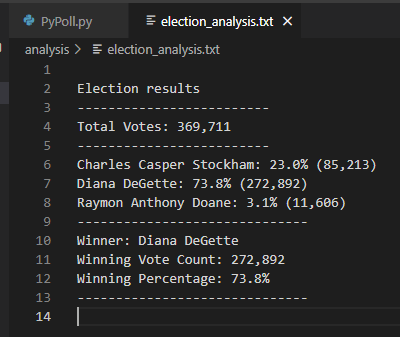

# Election Analysis

## Overview of Election Audit
A Colorado Board of Elections employee, Steve (and Seth) has given me the following tasks to complete the election audit of a recent local congressional election.

1. Calculate the total number of votes cast.
2. Get a complete list of candidates who received votes.
3. Calculate the total number of votes each candidate received.
4. Calculate the percentage of votes each candidate won.
5. Determine the winner of the election based on popular vote.
6. Calculate the total number of votes each county received.
7. Calculate the percentage of votes each county received.
8. Determine the county with the highest turnout.
9. Share the results on a text file, but also output on the terminal when the code is ran.

## Resources
-Data Source: election_results.csv
-Software: Python 3.7.6, Visual Studio Code, 1.71.0

[Election Analysis Challenge Python File](https://github.com/EnderFreak/Election_Analysis/blob/main/PyPoll_Challenge.py)

## Election-Audit Results
The analysis of the election show that:
- There were a total of 369,711 votes cast in the election.

- The counties involved were:
  - Jefferson
  - Denver
  - Arapahoe
- The county turnouts/number of votes were:
  - Jefferson received 10.5% of the vote and 38,855 number of votes.
  - Denver received 82.8% of the votes and 306,055 number of votes.
  - Arapahoe received 6.7% of the votes and 24,801 number of votes.
- The county with the highest turnout was:
  - **Denver** with 82.8% of total votes and 306,055 number of votes.  

- The candidates were:
  - Charles Casper Stockham
  - Diana DeGette
  - Raymond Anthony Doane
- The candidate results were:
  - Charles Casper Stockham received 23.0% of the vote and 85,213 number of votes.
  - Diana DeGette received 73.8% of the vote and 272,892 number of votes.
  - Raymond Anthony Doane received 3.1% of the vote and 11,606 number of votes.
- The winner of the election was:  
  - **Diana DeGette** who received 73.8% of the vote and 272,892 number of votes.  
  
## Challenge Overview
I had to navigate to the folder where the raw dataset was kept to read the file. Upon reading the file, a for loop was used to go through each row of the data and add the votes to each candidate. Now, we had to initialize a dictionary to contain all the candidates and add new candidates if new ones were found reading the data, and tally up their votes accordingly.  
A simple math funtion to calculate the percentage and the total votes were done, also using some conditional formating like showing the percentage to 1 decimal place.  

## Election-Audit Summary
In the end, we had to put the output in such a format that is eligible by any user. I have created a text file to also save the terminal output there, and the "w" in the open() was used to write to a text file.  
A overview of the election was printed; the total number of votes and the names of the running candidates. The summary of all the candidates with the percentage of the total vote were displayed as well as the winner of the election, as shown below:

Furthermore, this script can be used, with some modifications, for any election. A few notes to keep in mind is:
- make sure the path for the file to read and the text file to write in is written correctly in the "with open()" statement
- should the analysis be on another parameter like if there was a "State" field, making sure the "row[x]" where x is the column number starting at index 0, is changed to reflect the correct field.
- 
